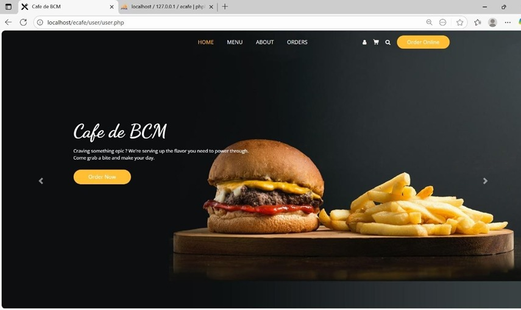
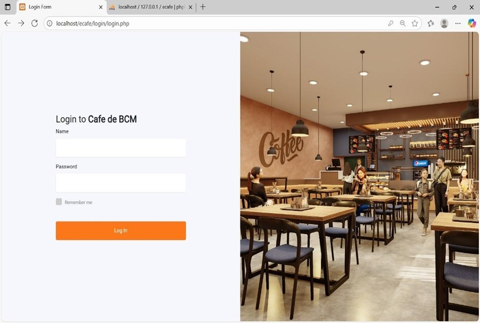
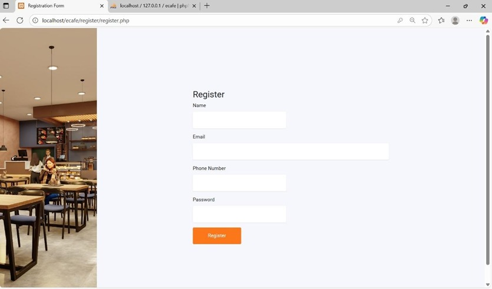
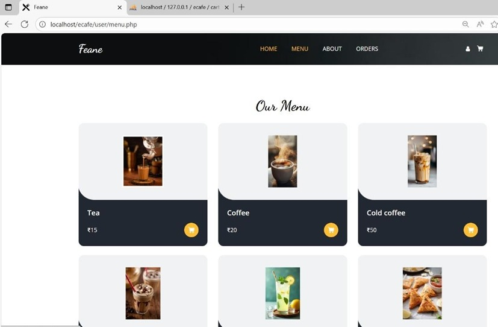
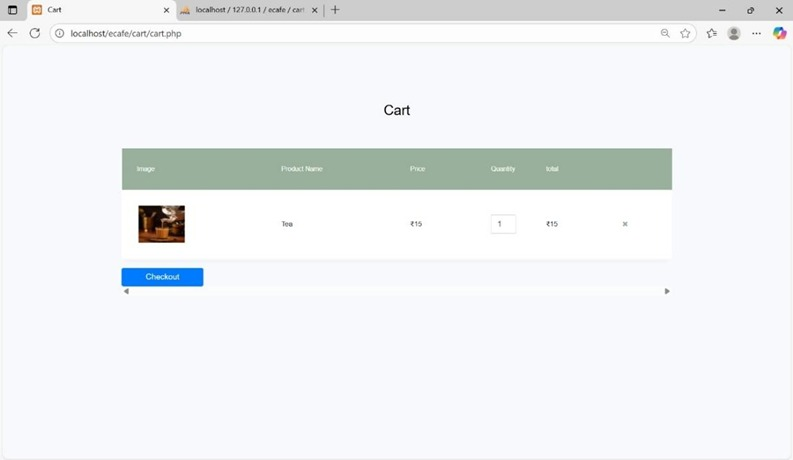
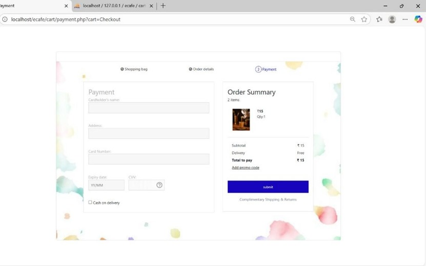
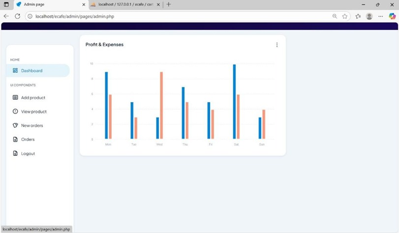
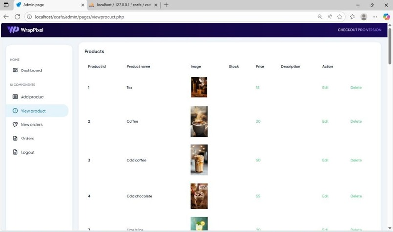
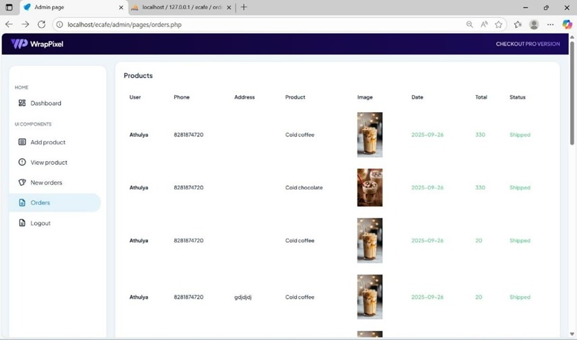

# E-Treat-Smart-Canteen-System
E-Treat is a smart canteen automation system developed using PHP and MySQL. It allows users to browse menus, place orders, and make payments online, while admins manage menu, orders, and sales. Developed as a mini project by Athulya Binu, Aarya Santhosh, Adithya A.S, and Thamara T.S.
## 📷 Screenshots

### 🏠 Home Page

### 🔐 Login Page

### 📝 Register Page

### 📋 Menu Page

### 🛒 Cart Page

### 💳 Payment Page

### 👨‍💼 Admin Dashboard

### 📦 Admin - View Products

### 📑 Admin - Orders

